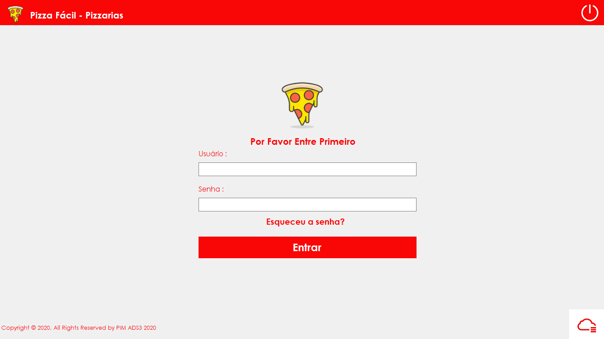
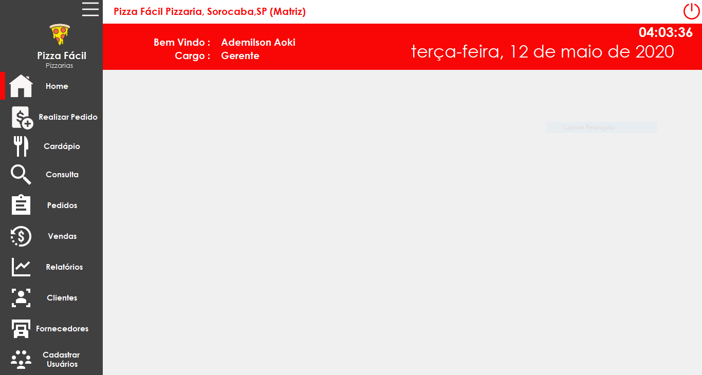
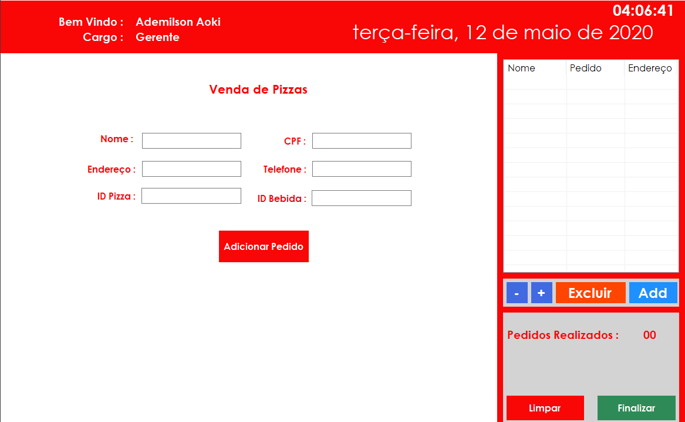

# Pim 2020 3º Semestre

Este é um projeto feito pelos integrantes Allef Marchetti Silva, Ademilson Aoki Belo, Gabriel Filgueira Laredo, Kaique Alexandre Alves. No qual foi proposto com base em um escopo a realização de um software de controle de uma pizzaria. Sendo usado no **back-end** **C#**, **front-end** sendo utilizado somente **Win-Forms**.

# Sistema 
- Telas de **login**,**Menu**,**Pedido**.
> Sendo essas as telas de maior importância dentro do software das quais vão ter uso de cerca de 70% dentro de todo software elas foram estilizadas para ter o melhor funcionamento do úsuario.

